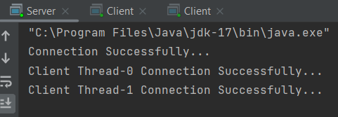
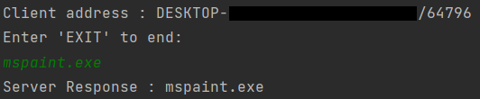
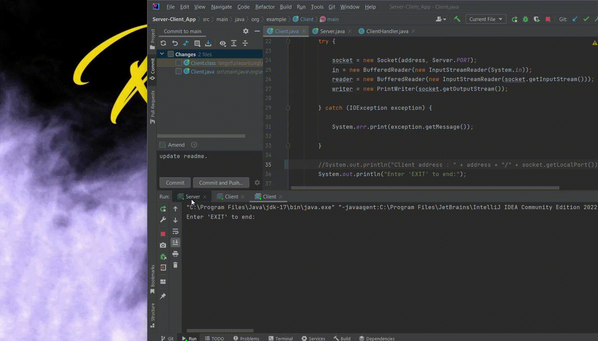

# MULTIPLE CLIENT TO SINGLE SERVER APPLICATION WITH JAVA

We start our project by creating Client, ClientHandler and Server Classes.

*Client Handler Class*

We start writing our ClientHandler class by first adding a constructor method. And we give a socket to the parameter of this constructor method.
Then, we perform input and output operations with BufferedReader and PrintWriter objects.
Then, we write the method that sends the parameters sent by the client to the server back to the client.

*Server Class*

We call the ServerSocket object in the Server Class and enter the port number in its parameter.
Then, we call the socket object and access this socket object to the server we created with the accept() method.
Then we call the ClientHandler class and give the socket to its parameter.
Then, we give the created clientHandler object the start() method and thus provide multiple client access to the server side.

*Client Class*

We get the address information of our client by using the InetAddress object in our Client Class.
Then, we perform input and output operations using BufferedReader and PrintWriter objects.
Then, we write the function that enables the use of Windows commands using the Process object.
And we complete our Client class.

*DEMO*

